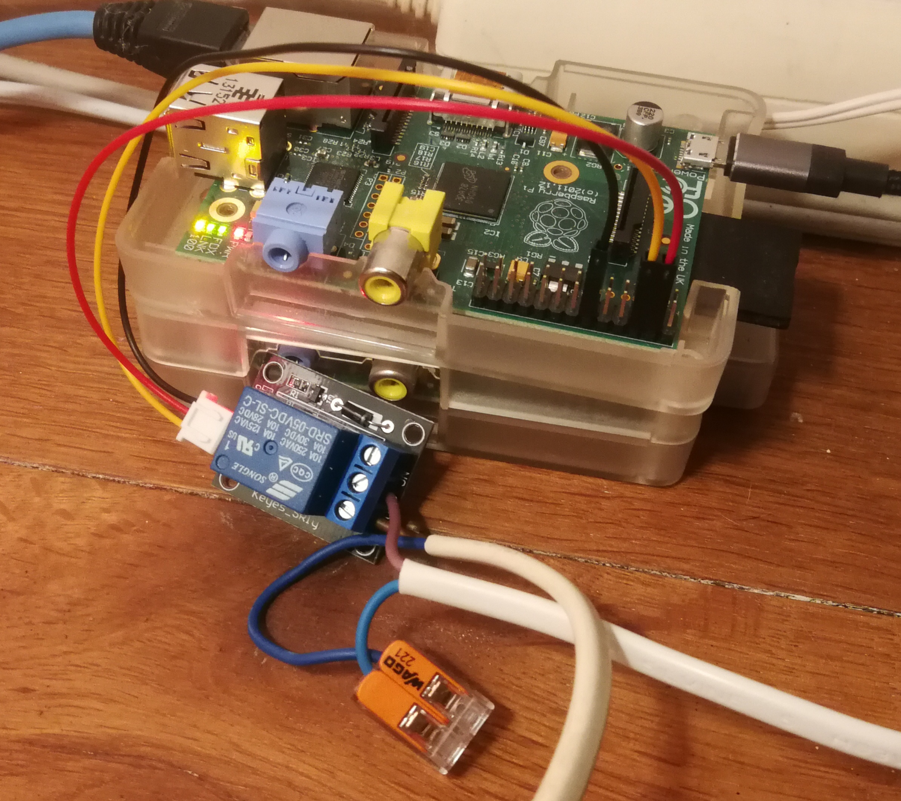

This repository contains a few small python programs that aim to allow to control GPIO 
outputs using a rest interface.
It it tested and runs on a rather old Raspberry Pi B Rev 2.0 which is running Raspberry Pi OS 
or Raspbian 11 (Bullseye). *Note that 11 is also a bit outdated since it was released 
in 2021 and its successor 12 (Bookworm) is already available since 2023.*

# Wiring

To check it is working I connected a simple relay module.



The relay module in this case the [Keyes SR1y](http://www.techydiy.org/keyes-sr1y-relay-module/) 
came with a pre-wired [JST connector](https://en.wikipedia.org/wiki/JST_connector). 
*Just ignore the choice of the colors which are not what i would normally choose or expect :blush:*
Wiring is as follows:

- pin 4 to supply power *(+, red wire)*
- pin 6 to GND *(-, yellow wire)*
- pin 12 (GPIO18) to signal *(black wire)*

## General Pi Rev 2 26-pin header information

Some general information on the 26 pin header from the old Pi:


- red ones are +ve power (3V3 or 5V)
- black ones are -ve ground
- yellow ones are all dedicated general purpose I/O ports (OK, 18 does PWM as well, but forget that for now).

The rest can all be used as GPIO ports, but do have other functions too. If you need 8 or less ports, it’s best to use the yellow ones because you’re less likely to have a conflict with other things. A quick rundown of what the others are…

- greeny/grey – i2c interface *(Inter-Integrated-Circuit; 2 wire protocol; pin3=SDA, pin5=SCL)*
- light grey – UART (serial port)
- orange – SPI *(Serial Peripheral Interface supporting upto 2 devices; pin19=MOSI, pin21=MISO, pin23=SCLK, pin 24=CE0, pin26=CE1; not turned on by default see sudo raspi-config)*

# Setup

Initial setup and python code was suggested by ChatGPT ;-)

```
sudo apt update && sudo apt upgrade -y
sudo apt install python3 python3-pip -y
pip3 install flask RPi.GPIO
```

# Run

Run both python programs since one is supplying a rest interface and the other
one builds a gui on top of this rest interface.

```
python3 rest.py &
python3 gui.py &
```

# Test

You can test the rest interface first as well as the gui. *Be sure to 
check and change the used ip number accordingly.*

```
curl -X GET "http://192.168.178.63:5000/gpio/status?pin=18"
curl -X POST -H "Content-Type: application/json" -d '{"pin": 18, "state": 1}' "http://192.168.178.63:5000/gpio"
{"pin":18,"state":1}
```

open the gui using the following [url-to-the-gui](http://192.168.178.63:8000)

# Run as a service

Create the service files to run automatically on startup.
*Note: you can also use the nano editor if vi is not your favorite one :-)*

```
sudo vi /etc/systemd/system/gpio_rest.service
```

Add following content

```
[Unit]
Description=GPIO REST API
After=network.target

[Service]
ExecStart=/usr/bin/python3 /home/pi/gpio-rest/rest.py
WorkingDirectory=/home/pi/gpio-rest
Restart=always
User=pi

[Install]
WantedBy=multi-user.target
```

```
sudo vi /etc/systemd/system/gpio_gui.service
```

Add following content

```
[Unit]
Description=GPIO GUI
After=network.target

[Service]
ExecStart=/usr/bin/python3 /home/pi/gpio-rest/gui.py
WorkingDirectory=/home/pi/gpio-rest
Restart=always
User=pi

[Install]
WantedBy=multi-user.target
```

Next Enable and Startup these services

```
sudo systemctl enable gpio_rest
sudo systemctl enable gpio_gui
sudo systemctl start gpio_rest
sudo systemctl start gpio_gui
```

Following are some checks and usefull system commands

```
systemctl status
systemctl list-units --state=failed

journalctl -fu gpio_gui.service

sudo systemctl daemon-reload

sudo systemctl start gpio_rest
sudo systemctl start gpio_gui
```
